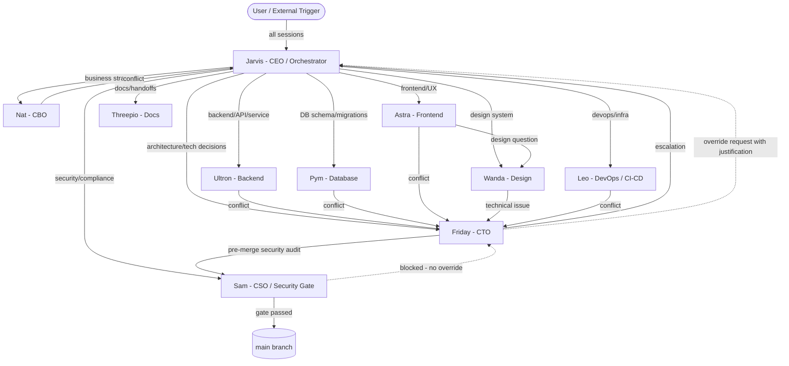

# Agent Dependency Map

**Last Updated:** 2026-05-21  
**Owner:** Friday (CTO)

Documents which agents call which, data flow, failure propagation, retry behavior, and SLAs.

---

## Dependency Diagram



---

## Call Chain Examples

### Feature development (typical path)
```
User → Jarvis → Ultron (backend) → Friday (architecture conflict) → Sam (pre-merge) → main
                → Pym (DB schema) ─────────────────────────────────────────────────────┘
```

### UI feature with design review
```
User → Jarvis → Astra (frontend) → Wanda (design question) → Astra (implementation)
                                 → Friday (if technical conflict)
              → Sam (pre-merge) → main
```

### Infrastructure change
```
User → Jarvis → Leo (devops/CI-CD) → Friday (if architecture impact)
              → Sam (pre-merge) → main
```

### Security incident
```
Detect → Sam (owns it) → Jarvis (escalation if >30min blocker)
       → Friday (remediation design) → Sam (verification) → main
```

---

## Failure Mode Analysis

| Agent | Failure Mode | Detection Signal | Who Retries | Timeout | Override / Recovery |
|---|---|---|---|---|---|
| Jarvis | Startup fails / no response | No session log update in >3h | Self-retry once | 30 min | Escalate to Nathan directly |
| Sam | Security audit blocked / unavailable | PR sits without approval >8h | None — Sam owns gate | 8h SLA | Friday documents justification → Jarvis written approval |
| Friday | Architecture decision stalled | GitHub issue no update >4h | Self-retry once | 4h SLA | Escalate to Jarvis |
| Ultron | Backend task stalled | PR not opened >2h after start | Friday retries once | 2h | Friday takes over, re-delegates |
| Pym | Migration fails | CI test failure | Friday retries + review | 1h | Friday reviews schema, re-runs |
| Astra | Frontend build fails | CI failure on PR | Astra retries once | 1h | Friday reviews, may delegate to Ultron |
| Leo | CI/CD pipeline failure | Build status red | Leo retries up to 2x | 15 min | Friday reviews infra config |
| Wanda | Design review stalled | Astra waiting >1h | Astra proceeds with best judgment | 1h | Friday unblocks |
| Nat | Strategy decision stalled | No response >24h | Jarvis retries | 24h | Jarvis decides |
| Threepio | Docs incomplete | PR review comment | Threepio retries | 30 min | Domain expert fills gaps |
| Memory sync | Sync lag between CLIs | File timestamp check fails | Leo retries sync job | 5 min | Manual `sync_agents_from_repo.ps1` |

---

## Retry Conventions

- **Max retries:** 2 for all automated agents; 1 for human-gate agents (Sam, Jarvis)
- **Backoff:** 5 min wait between retries for network-related failures
- **Idempotency:** All mutations (file writes, memory updates) must be idempotent — retrying a completed operation must produce same result without duplication
- **Postcondition check:** After each retry, verify the expected state change occurred before proceeding

---

## Data Flow

```
User input → Jarvis (routing decision)
           → Agent (domain work → produces artifact: code, doc, decision)
           → Sam (security check if main-bound)
           → main branch (via PR + CI)
           → .agents/memory/<agent>.md (decision log updated)
           → HANDOFF.md (in-flight/blockers updated if needed)
           → .agents/AGENTS-MEMORY.md (index updated weekly by Jarvis)
```
